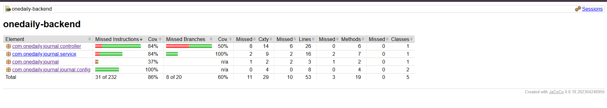

# 📝 OneLineDaily Journal

A minimalistic, full-stack journaling web application designed for users to effortlessly capture and reflect on their daily thoughts. It provides a smooth user experience with robust API validation.

---

## ✨ Features

* **Effortless Journaling:** Easily add, edit, and delete daily journal entries.
* **Real-time Search:** Quickly find entries with an intuitive, real-time search functionality.
* **Smooth User Interface:** Enjoy a modern and responsive user experience powered by **Framer Motion** animations.
* **Robust Backend:** A **RESTful API** built with **Spring Boot** ensures reliable data handling.
* **Persistent Storage:** Data is securely stored using **MongoDB**.
* **Automated API Testing:** **Keploy** is integrated for automated API testing, ensuring reliable and validated endpoints.
* **Comprehensive Manual Testing:** Implemented unit, integration, and API tests with **80%+ code coverage** using JUnit, Mockito & MockMvc.
* **Seamless Communication:** **CORS** is pre-configured for smooth communication between the frontend and backend.

---

## ⚙️ Tech Stack

| Layer | Tech Used |
|--------------|----------------------------------|
| Frontend | React.js, Framer Motion, Hot Toast |
| Backend | Spring Boot (Java) |
| Database | MongoDB |
| API Testing | Postman |
| Unit/API Test| JUnit 5, Mockito, MockMvc |
| Code Coverage| JaCoCo |
| Build Tool | Maven |

---

## 🚀 Getting Started

Follow these steps to get "One Daily Journal" up and running on your local machine.

### 🔧 Prerequisites

Ensure you have the following installed:

- **Node.js:** v14 or above
- **Java Development Kit (JDK):** Version 17 or above
- **MongoDB:** Installed and running locally or accessible remotely

---

### 🛠️ Installation

#### 1. **Clone the Repository:**

```bash
git clone https://github.com/Arpreet2107/onelinedaily.git
cd onelinedaily
```
#### 2. Backend Setup (Spring Boot):**
```
cd backend
Configure MongoDB in src/main/resources/application.properties:
spring.data.mongodb.uri=mongodb://localhost:27017/onelinedaily
Run the backend:
Globally Install Maven then:
mvn spring-boot:run
```
#### 3. Frontend Setup (React):**
```
cd frontend
npm install
npm start

Frontend runs on: http://localhost:3000
Backend runs on: http://localhost:8080
```

### API Endpoints

The following RESTful API endpoints are available:

* **GET `/api/entries`**: Retrieve all journal entries.
* **POST `/api/entries`**: Create a new journal entry.
* **PUT `/api/entries/{id}`**: Update an existing journal entry by its ID.
* **DELETE `/api/entries/{id}`**: Delete a journal entry by its ID.

---

### Testing & Coverage
```
This project includes 3 types of tests:

1. 🧪 Unit Tests
File: EntryServiceTest.java

Tests service logic using Mockito (mocked repository).

Ensures validation, logic, and null safety.

2. 🧩 Integration Tests
File: EntryRepositoryTest.java

Tests repository with real MongoDB connection.

3. 🌐 API Tests
File: EntryControllerTest.java

Uses MockMvc to simulate real HTTP requests to the controller.

Covers all API operations: GET, POST, PUT, DELETE.
```
---
### ✅ Test Coverage Report

Achieved **86% test coverage** using JUnit, Mockito, and JaCoCo.




---

### 📊 Code Coverage: **
```
Achieved 87% total test coverage using JaCoCo.

Includes unit, integration, and controller test layers.

📸 Coverage Report Path:onelinedaily\onelinedaily-backend\target\site\jacoco\index.html
```
---
#### 🧱 Project Structure:
```
onelinedaily/
├── backend/
│   └── src/
│       ├── main/java/com/onedaily/journal/
│       │   ├── controller/
│       │   ├── model/
│       │   ├── repository/
│       │   └── service/
│       └── test/java/com/onedaily/journal/
│           ├── EntryServiceTest.java
│           ├── EntryControllerTest.java
│           └── EntryRepositoryTest.java
├── frontend/
│   ├── src/
│   └── public/
```
---
### 🤝 Contributors
#### 💻 Arpreet Mahala – Full Stack Developer

#### 🧪Special thanks to Keploy for the testing framework and inspiration!
